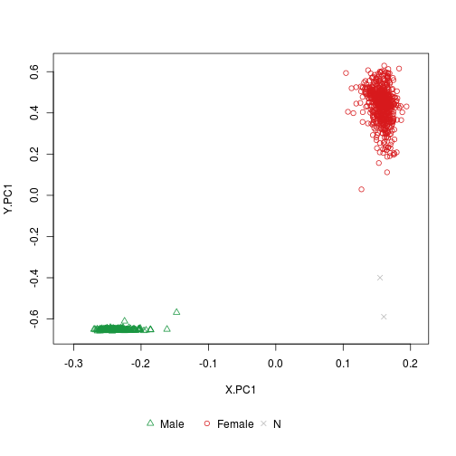
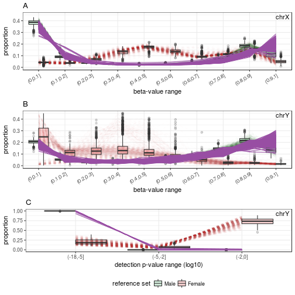
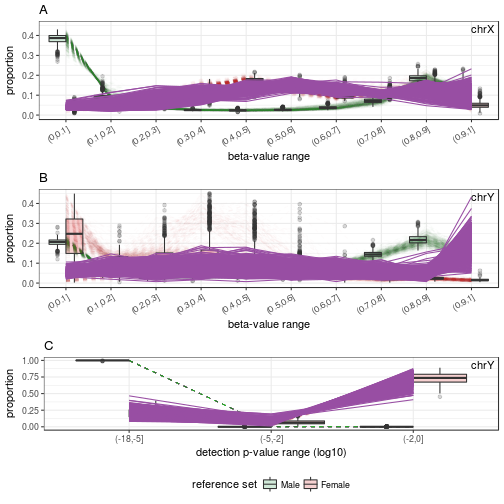
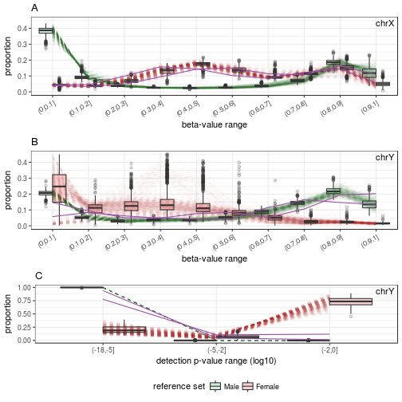
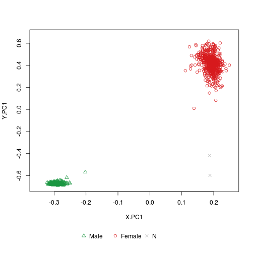

# sEst example

### loading thelibrary and data.

```{r}
library(sest)

load("../data_preparation/beta.bg.XY.rda")
load("../data_preparation/p.XY.rda")
load("../data_preparation/pd.rda")
load("../data_preparation/QC.rda")
```

### Sample QC, using the per-sample call-rate of chrX probes.

```{r}
samples.GSE51032 <- rownames(pd)
samples.GSE51032.good <- samples.GSE51032[QC[samples.GSE51032, "callrate.X"]>0.95]
```

### Running sex-estimation
```{r}
sex.GSE51032.good <- estimateSex(beta.value=beta.bg.XY[, samples.GSE51032.good], detecP=p.XY[, samples.GSE51032.good], return_with_reference=TRUE)
```

### Contents of the 'estimateSex' results:
```{r}
names(sex.GSE51032.good)
```

```{r}
head(sex.GSE51032.good$test)
```

### Plot of sex-estimation result by 'plotSexEstimation':
```{r}
plotSexEstimation(sex.GSE51032.good)
```


### Plot of sex-estimation result by 'plotSexEstimation', including reference samples:
```{r}
plotSexEstimation(sex.GSE51032.good, include_reference = TRUE)
```

Distribution profile plot of Male-predicted samples by 'plotSexDistribution':
```{r}
samples.GSE51032.good.M <- rownames(sex.GSE51032.good$test)[sex.GSE51032.good$test$predicted == "M"]
plotSexDistribution(beta.value=beta.bg.XY, detecP=p.XY, samples=samples.GSE51032.good.M)
```


Distribution profile plot of Female-predicted samples by 'plotSexDistribution':
```{r}
samples.GSE51032.good.F <- rownames(sex.GSE51032.good$test)[sex.GSE51032.good$test$predicted == "F"]
plotSexDistribution(beta.value=beta.bg.XY, detecP=p.XY, samples=samples.GSE51032.good.F)
```


Distribution profile plot of N-predicted samples by 'plotSexDistribution':
```{r}
samples.GSE51032.good.N <- rownames(sex.GSE51032.good$test)[sex.GSE51032.good$test$predicted == "N"]
plotSexDistribution(beta.value=beta.bg.XY, detecP=p.XY, samples=samples.GSE51032.good.N)
```



Trying the sex-estimation using different beta-value intervals
```{r}
sex.GSE51032.good.5 <- estimateSex(beta.value=beta.bg.XY[, samples.GSE51032.good], detecP=p.XY[, samples.GSE51032.good], return_with_reference=TRUE, beta.intervals.X = seq(0,1,0.2), beta.intervals.Y = seq(0,1,0.2))

plotSexEstimation(sex.GSE51032.good.5)
```

